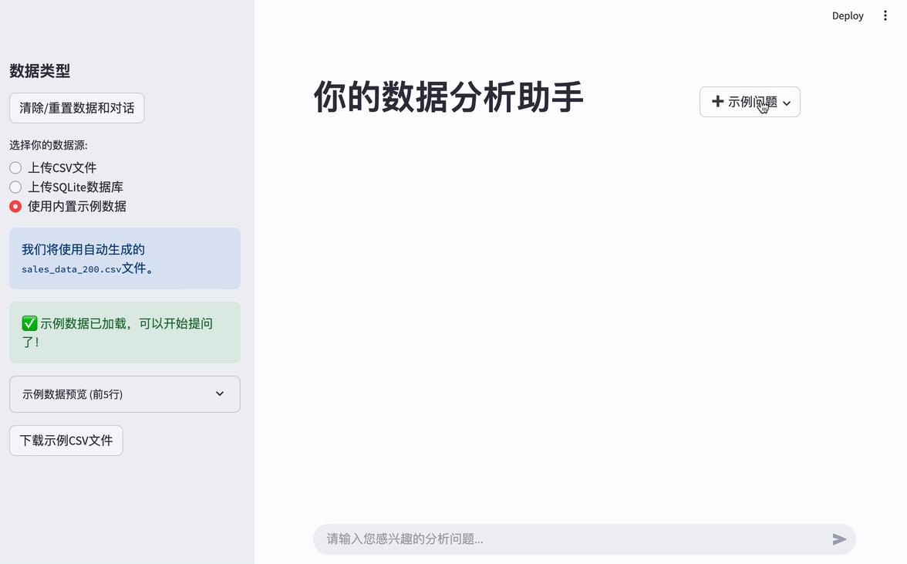
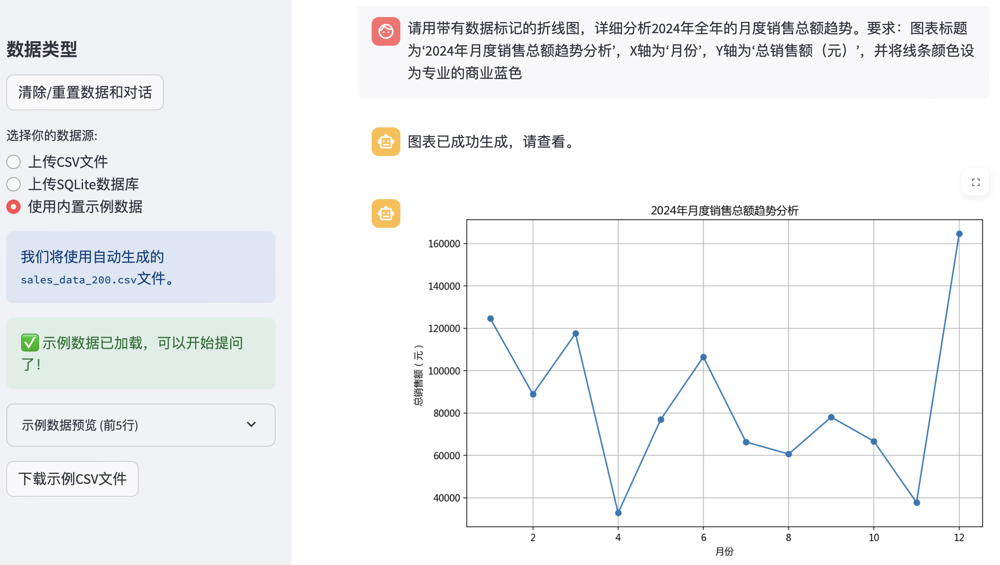
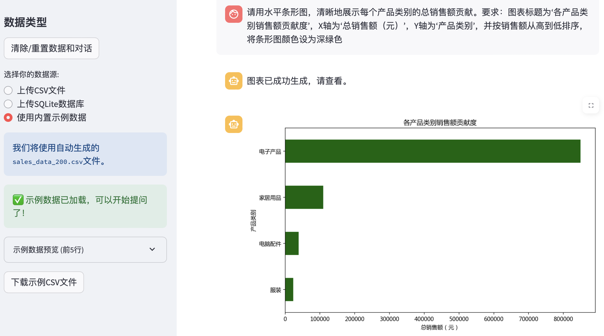
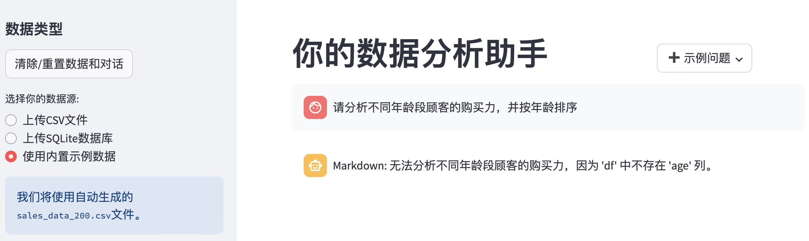
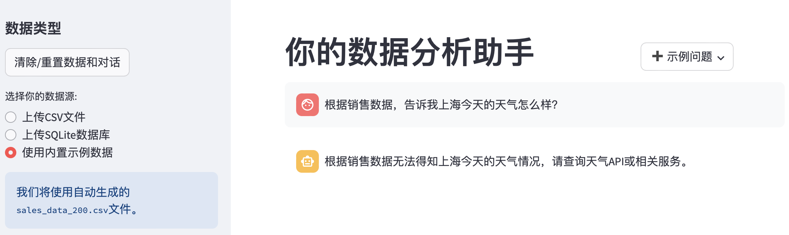

# Agentic-Analytics

一款基于Agentic架构的对话式AI数据分析工具，以“可靠性优先，白盒可控”为核心设计哲学，旨在为用户提供稳定、可信赖的数据洞察，并探索构建生产级自动化分析工作流的未来。

---

## 1. 愿景与痛点 (The Why)

### 要解决的核心问题
个体提效”到“组织赋能”的价值飞跃，并始终贯彻“可靠性优先”的核心理念。

*   **V1.0 (当前): 可靠的单点工具。** 核心是**自研线性执行**
1.  **技术门槛阻碍洞察:** 业务人员被复杂的Python/SQL挡在数据分析的门外。
2.  **通用AI的“黑盒”困境:** 通用工具的过程不可控和结果偶然性，使其难以成为可被完全信赖的生产力工具。

### 我们的产品使命:
在V1.0阶段，我们有意地聚焦于优化单轮问答（Single-turn Q&A）的体验，追求每一次执行的极致可靠。我们坚信，**可靠性是信任的基石**，也是一切更高级智能的起点。

---

## 2. 核心设计与实现 (The How & The What)
**多Agent协作**的“AI数据分析助手”，自主完成端到端的复杂分析项目。

### 2.1 核心功能一览

*   ✅ **双数据源支持:** 文件上传 (CSV) & 数据库直连。
*   ✅ **自然语言驱动:** 通过单轮对话完成数据查询、分析与可视化。
*   ✅ **智能双模输出:** 自动生成数据表格 (Markdown)和图像。
    *   因此，我更倾向于采用像 **LangGraph** 这样的框架。它能让我将整个分析流程精确地编排为一个**“状态图”**，确保每一次分析都遵循一个**稳定、可预测、可调试的标准化路径**。这与我在V1.0中自研执行器的设计哲学一脉相承，都是为了最终交付一个**真正值得信赖**的生产级AI产品。
    *   **商业价值跃升：** 将产品的核心价值，从**“为个人提效”**彻底转变为**“为组织 或 可视化图表 (Matplotlib)。

### 2.2 架构设计：为“可靠性”与“可维护性”奠基
#### 2.2.1 异构Agent引擎：因地制宜，简单分工
*   *(在此处可添加1-2句关于异构Agent的具体描述)*

#### 2.2.2 自研线性执行器：从“黑盒失控”到“白盒可控”
*   *(在此处可添加1-2句关于自研执行器如何保证可靠性的赋能”**，自动化完成过去需要一个团队数周才能完成的深度分析项目。

### 2.3 交互优化：聚焦单次任务的流畅体验
*   *(在此处可添加1-2句关于两段式Rerun如何缓解用户等待焦虑的描述)*

---

## 3. 案例研究 (Case Study): 从原始数据到可行动的洞察

为了全面展示“数据分析助手”的实际应用价值和技术可靠性，我们以一个典型的商业场景为例，进行一次完整的端到端数据探索。

**背景 (Background):**
我们获得了一家在线零售店2024年的销售数据。作为该店的数据分析师，我们的目标是利用“数据分析助手”深入挖掘数据，从多个维度评估其业务表现，并为未来的营销和库存策略提供数据驱动的洞察。

---
### Part 1: 从数据到洞察 — 挖掘核心业务价值

在这一部分，我们专注于利用助手强大的分析和可视化能力，从原始数据中提炼出关键的商业洞察。

#### 1. 宏观趋势分析：我们今年的增长情况如何？

**➡️ 向助手提问:**
> "请用带有数据标记的折线图，详细分析2024年全年的月度销售总额趋势。要求：图表标题为‘2024年月度销售总额趋势分析’，X轴为‘月份’，Y轴为‘总销售额（元）’，并将线条颜色设为专业的商业蓝色。"

**💡 助手的回答:**

**洞察与分析 (Insight & Analysis):**
从图表中我们可以直观地看到，销售额在年初表现平稳，从第二季度开始呈现显著的增长趋势。销售高峰出现在特定的节假日促销月份，这表明公司的营销策略是有效的。整体增长趋势表明公司业务处于健康发展轨道，管理层应重点复盘销售高峰月份的成功经验，并分析销售低谷期的原因以制定相应的提振计划。

#### 2. 核心业务定位：我们的“现金牛”业务是什么？

**➡️ 向助手提问:**
> "请用水平条形图，清晰地展示每个产品类别的总销售额贡献。要求：图表标题为‘各产品类别销售额贡献度’，X轴为‘总销售额（元）’，Y轴为‘产品类别’，并按销售额从高到低排序，将条形图颜色设为深绿色。"

**💡 助手的回答:**

**洞察与分析 (Insight & Analysis):**
条形图清晰地显示，“电子产品”是绝对的销售主力，贡献了超过一半的销售额，是公司的核心业务。而“家居用品”和“服装”的销售额相对较低。基于此，我们建议确保“电子产品”类别的库存充足，并持续投入营销资源以巩固优势。对于销售额较低的品类，建议进行专项市场调研，分析是产品本身不受欢迎还是营销投入不足，并据此调整策略。

---

### Part 2: 从智能到智慧 — 探索助手的可靠性边界

一个强大的分析伙伴不仅在于它能回答什么，更在于它知道自己不能回答什么。接下来，我们通过几个“压力测试”来探索助手的可靠性与行为边界。

#### 3. 忠实性测试：助手会“捏造”不存在的数据吗？

**➡️ 向助手提问:**
> "请分析不同年龄段顾客的购买力，并按年龄排序。"

**💡 助手的回答:**

**洞察与分析 (Insight & Analysis):**
这是一个**非常积极**的结果。助手没有“产生幻觉”或捏造数据，而是通过检查数据库表结构，诚实地指出数据集中没有顾客年龄信息。这证明了助手的高度可靠性，它的所有分析都严格基于所提供的数据源，这是在严肃商业分析中至关重要的品质。

#### 4. 职责边界测试：助手会“越界”回答问题吗？

**➡️ 向助手提问:**
> "根据销售数据，告诉我上海今天的天气怎么样？"

**💡 助手的回答:**

**洞察与分析 (Insight & Analysis):**
助手再次清晰地界定了自己的职责范围——一个**专注的数据分析工具**，而非通用的聊天机器人。它明确表示自己无法获取实时的外部信息。这种“专注”确保了输出结果的专业性和相关性，避免了提供无法验证的错误信息。

---

### 结论 (Conclusion)

通过这个 Case Study，我们不仅利用“数据分析助手”从原始数据中提取了关键的商业洞察，还验证了它作为一个AI工具的可靠性与诚实度。它既是一个强大的分析引擎，也是一个值得信赖的合作伙伴。

---

## 4. 差异化优势总结 (Our Differentiators)

| 特性 | 我们的AI助手 (V1.0) | 通用大模型工具 (如ChatGPT) |
| :--- | :---: | :---: |
| **任务模式** | ⭐️ 单次任务优化 | 通用多轮对话 |
| **执行过程** | ⚪️ 白盒可控 (后台透明) | ⚫️ 黑盒 (过程未知) |
| **风险控制** | ✅ 高 (架构级限制) | ⚠️ 中 (依赖模型自身能力) |
| **可维护性** | ✅ 高 (问题可精准定位) | ❌ 低 (调试困难) |

---

## 5. 产品路线图 (The Roadmap)

我们对产品的未来有清晰的规划，旨在实现从“个体提效”到“组织赋能”的价值飞跃，并始终贯彻“可靠性优先”的核心理念。

*   **V1.0 (当前): 可靠的单点工具。** 核心是**“自研线性执行器”**，确保了单次任务的执行过程稳定可控。
*   **V2.0 (规划中): 智能的业务伙伴。** 核心是引入**RAG技术**，驱动一个能理解业务上下文的**“主动洞察式AI Dashboard”**，在不牺牲可靠性的前提下提升智能水平。
*   **V3.0 (愿景): 生产级的自动化专家团队。** 核心是构建一个基于**多Agent协作**的**“AI数据分析团队”**，自主完成端到端的复杂分析项目。
    *   **核心理念与技术选型：** 在构思V3.0时，我的独立思考是，必须构建一个**“白盒可控”的自动化工作流**。虽然像AutoGén这样的框架在模拟创造性对话方面很方便，但其“黑盒”特性与我们产品对可靠性的核心要求相悖。
    *   因此，我更倾向于采用像 **LangGraph** 这样的框架。它能让我将整个分析流程精确地编排为一个**“状态图”**，确保每一次分析都遵循一个**稳定、可预测、可调试的标准化路径**。这与我在V1.0中自研执行器的设计哲学一脉相承，都是为了最终交付一个**真正值得信赖**的生产级AI产品。
    *   **商业价值跃升：** 将产品的核心价值，从**“为个人提效”**彻底转变为**“为组织赋能”**，自动化完成过去需要一个团队数周才能完成的深度分析项目。

---

## 6. 技术栈 (Tech Stack)

本项目综合运用了以下技术与平台，构建了一个端到端的、以“可靠性”为核心的AI数据分析解决方案。

### 核心语言与数据科学 (Core Language & Data Science)

*   **Python:** 作为项目的主要开发语言。
*   **Pandas & NumPy:** 强大的数据处理双雄，用于高效地进行数据操作、清洗和数值计算。
*   **Matplotlib:** 负责将分析结果转化为富有洞察力的、动态交互的可视化图表。

### AI框架与核心技术 (AI Frameworks & Core Technologies)

*   **LangChain & LangGraph:** 作为整个系统的“神经中枢”。我们利用LangChain强大的生态，并选择**LangGraph**来精确编排复杂的、非线性的多Agent协作工作流。
*   **Agentic Architecture:** 项目的核心设计思想。通过模拟专家团队进行角色分-工与协作，来解决单一Agent无法处理的复杂问题。
*   **Prompt Engineering:** 精心设计与优化同大语言模型交互的指令，以确保输出结果的准确性、可靠性与格式统一。
*   **RAG (Retrieval-Augmented Generation):** 作为V2.0路线图中的核心技术，已完成深入研究与规划，旨在未来解决AI的“行业黑话”理解问题。

### AI平台与模型 (AI Platforms & Models)

*   **ZhipuAI API (GLM Series):** 作为项目主要的推理后端，提供强大的语言理解、代码生成与分析能力。
*   **OpenAI API (GPT-4 Series):** 在开发过程中被用作**基准模型 (Baseline Model)**，用于横向对比测试，以确保方案的先进性和有效性。

### 前端与开发工具 (Frontend & Development Tools)

*   **Streamlit:** 用于快速将后端分析能力，封装成一个对用户友好的、交互式的Web产品原型。
*   **Git & GitHub:** 用于代码的版本控制、协作管理和项目展示。
  
---

## 7. AI辅助开发与研究 (AI-Assisted Development & Research)
值得一提的是，本项目的整个开发过程，从前期的技术研究、架构设计，到后期的代码编写与调试，都深度借助了 **Google Gemini** 作为核心的AI编程与设计伙伴。

Gemini在**技术方案对比（如AutoGén vs. LangGraph）、复杂代码生成、以及本文档（README）的撰写和润色**等方面，扮演了至关重要的“副驾驶”和“设计顾问”角色。这个项目本身，既是AI在数据分析领域应用的一次探索，也是一次人与AI高效协作，共同完成复杂软件工程的成功实践。
